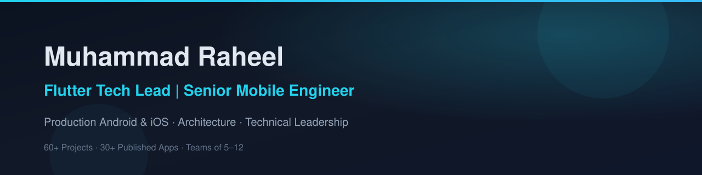
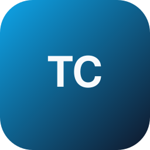
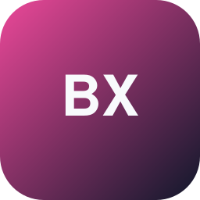

<!--
  GitHub Profile README — Muhammad Raheel
  Flutter Tech Lead | Senior Mobile Engineer
  Personal developer profile (not an agency/company page)
-->

  

  <!-- Animated typing headline (readme-typing-svg / demolab) -->
  

  <!-- Fallback (visible in raw Markdown / if animation fails): -->
  <!-- **Flutter Tech Lead · Senior Mobile Engineer · Android & iOS · Production-Ready Apps** -->

   

  ### Muhammad Raheel
  **Flutter Tech Lead | Senior Mobile Engineer**

  Hands-on technical lead shipping production Android & iOS apps with Flutter — architecture, integrations, releases, and team leadership.

   

  
  
  
  

    

  
  
  
  

---

## 💼 Open to Opportunities

**Available for the right engineering and technical leadership opportunity.**

| Full-Time | Part-Time | Contract | Remote |
|:---------:|:---------:|:--------:|:------:|
| ✅ | ✅ | ✅ | ✅ |

`Senior Flutter Developer` · `Flutter Tech Lead` · `Mobile Engineering` · `Technical Leadership`

---

## 👋 About Me

I'm a **Flutter Tech Lead** and **Senior Mobile Engineer** focused on production Android and iOS applications — from architecture and feature delivery through App Store and Google Play release.

I work across Flutter/Dart, Firebase, REST & GraphQL APIs, payments, AI integrations, and CI/CD. I've delivered **60+ software projects**, contributed to **30+ published mobile apps**, and led/mentored teams of **5–12 developers**. I operate confidently as an independent senior contributor or as a hands-on technical lead.

🌐 Portfolio: [muhammadraheel.dev](https://muhammadraheel.dev/)

---

## 🧭 Career Experience

### Codergize — Lebanon
**Flutter Tech Lead** · March 2024 – Present · Remote

### Fleact Tec — Islamabad
**Senior Flutter Developer** · December 2023 – February 2024 · Remote

### Microprogrammer — Layyah
**Flutter Trainer / Team Lead / Senior Flutter Developer** · June 2022 – October 15, 2023 · Onsite

### Freelance
**Java Android App Developer** · ~6 months

---

## 🛠 Tech Stack

### Mobile

### Architecture

### State Management

### Backend / APIs

### Firebase

### Local Storage

### AI

### Payments

### CI/CD

### Tools

---

## 📊 GitHub Statistics

<!-- Stats & top-langs are committed locally (official vercel.app host is often paused).
     Refreshed daily by .github/workflows/update-readme-stats.yml -->

  
  

   

  

---

## 🚀 Featured Projects

Production mobile products across on-demand services, social, commerce, loyalty, logistics, and marketplace domains.

<table>
  <tr>
    <td width="33%" valign="top" align="center">
       
      <strong>Tamam Customer</strong> 
      On-Demand Services  
      On-demand services platform connecting customers with service providers through a seamless booking experience.  
      <code>Flutter</code> <code>Firebase</code> <code>APIs</code> 
      <code>Android</code> <code>iOS</code>  
      <a href="https://apps.apple.com/pk/app/tamam-services-on-demand/id6740270481">App Store</a> ·
      <a href="https://play.google.com/store/apps/details?id=com.tamam.customer">Google Play</a>
    </td>
    <td width="33%" valign="top" align="center">
       
      <strong>Tamam Vendor</strong> 
      Vendor Operations  
      Vendor platform for managing bookings, services, and business operations within the Tamam network.  
      <code>Flutter</code> <code>Firebase</code> <code>APIs</code> 
      <code>Android</code> <code>iOS</code>  
      <a href="https://apps.apple.com/pk/app/tamam-vendor/id6740737001">App Store</a> ·
      <a href="https://play.google.com/store/apps/details?id=com.tamam.vendor">Google Play</a>
    </td>
    <td width="33%" valign="top" align="center">
       
      <strong>Blaxity</strong> 
      Social / Dating / Lifestyle  
      Social and dating/lifestyle platform focused on connecting people and couples through profiles, social experiences, and events.  
      <code>Flutter</code> <code>APIs</code> 
      <code>Android</code> <code>iOS</code>  
      <a href="https://apps.apple.com/pk/app/blaxity-dating-meet-couples/id1481975275">App Store</a> ·
      <a href="https://play.google.com/store/apps/details?id=com.appp.blaxity">Google Play</a>
    </td>
  </tr>
  <tr>
    <td width="33%" valign="top" align="center">
       
      <strong>Droparabia</strong> 
      B2B Dropshipping  
      B2B dropshipping platform connecting merchants with products, Shopify stores, inventory, orders, and wallet-based payments.  
      <code>Flutter</code> <code>Shopify API</code> <code>Payments</code> 
      <code>Android</code>  
      <a href="https://play.google.com/store/apps/details?id=com.codergize.droparabia">Google Play</a>
    </td>
    <td width="33%" valign="top" align="center">
       
      <strong>Rewardee</strong> 
      Loyalty & Rewards  
      Digital loyalty and rewards platform helping businesses engage customers through rewards, memberships, and offers.  
      <code>Flutter</code> <code>Firebase</code> <code>APIs</code> 
      <code>Android</code> <code>iOS</code>  
      <a href="https://apps.apple.com/pk/app/rewardee/id6751753673">App Store</a> ·
      <a href="https://play.google.com/store/apps/details?id=com.rewardee.app">Google Play</a>
    </td>
    <td width="33%" valign="top" align="center">
       
      <strong>Ride Hailing</strong> 
      Transportation  
      Transportation platform connecting riders and drivers through booking, location tracking, trip management, and operational workflows.  
      <code>Flutter</code> <code>APIs</code> 
      <code>Android</code> <code>iOS</code>  
      <em>Store links — add when public</em>
    </td>
  </tr>
  <tr>
    <td width="33%" valign="top" align="center">
       
      <strong>Logicorp</strong> 
      Business Operations  
      Business-oriented application supporting organizational and operational workflows.  
      <code>Flutter</code> <code>APIs</code> 
      <code>Android</code>  
      <a href="https://play.google.com/store/apps/details?id=com.logicorp">Google Play</a>
    </td>
    <td width="33%" valign="top" align="center">
       
      <strong>Tradyom</strong> 
      Marketplace  
      Marketplace platform connecting buyers and sellers through product discovery, purchasing, and order workflows.  
      <code>Flutter</code> <code>APIs</code> <code>Payments</code> 
      <code>Android</code>  
      <a href="https://play.google.com/store/apps/details?id=com.codergize.tradyom">Google Play</a>
    </td>
    <td width="33%" valign="top" align="center">
       
      <strong>MegaMart</strong> ⭐ 
      E-commerce · Highly Downloaded  
      E-commerce application for product discovery, shopping, checkout, and order management.  
      <strong>One of my most-downloaded applications.</strong>  
      <code>Flutter</code> <code>APIs</code> 
      <code>Android</code>  
      <a href="https://play.google.com/store/apps/details?id=com.codergize.megamarttt">Google Play</a>
    </td>
  </tr>
</table>

---

## 📱 Published on App Store & Google Play

### Apple App Store
| App | Link |
|-----|------|
| Rewardee | [App Store](https://apps.apple.com/pk/app/rewardee/id6751753673) |
| Blaxity | [App Store](https://apps.apple.com/pk/app/blaxity-dating-meet-couples/id1481975275) |
| SavenCrave | [App Store](https://apps.apple.com/pk/app/savencrave/id6736619591) |
| Tamam Services On-Demand | [App Store](https://apps.apple.com/pk/app/tamam-services-on-demand/id6740270481) |
| Tamam Vendor | [App Store](https://apps.apple.com/pk/app/tamam-vendor/id6740737001) |
| LIVO Wellness | [App Store](https://apps.apple.com/pk/app/livo-wellness/id6752313094) |

### Google Play
| App | Link |
|-----|------|
| Tamam Customer | [Google Play](https://play.google.com/store/apps/details?id=com.tamam.customer) |
| Tamam Vendor | [Google Play](https://play.google.com/store/apps/details?id=com.tamam.vendor) |
| Blaxity | [Google Play](https://play.google.com/store/apps/details?id=com.appp.blaxity) |
| Droparabia | [Google Play](https://play.google.com/store/apps/details?id=com.codergize.droparabia) |
| Rewardee | [Google Play](https://play.google.com/store/apps/details?id=com.rewardee.app) |
| Tradyom | [Google Play](https://play.google.com/store/apps/details?id=com.codergize.tradyom) |
| MegaMart | [Google Play](https://play.google.com/store/apps/details?id=com.codergize.megamarttt) |
| Logicorp | [Google Play](https://play.google.com/store/apps/details?id=com.logicorp) |
| Vigrand | [Google Play](https://play.google.com/store/apps/details?id=com.veev.vigrand) |
| Hooray | [Google Play](https://play.google.com/store/apps/details?id=com.codergize.hooray) |
| SavenCrave | [Google Play](https://play.google.com/store/apps/details?id=com.codergize.savencrave) |
| Fee | [Google Play](https://play.google.com/store/apps/details?id=com.codergize.fee) |
| SoftStations | [Google Play](https://play.google.com/store/apps/details?id=com.codergize.softstations) |
| DocDoc Customer | [Google Play](https://play.google.com/store/apps/details?id=com.docdoc.customer) |
| DocDoc Vendor | [Google Play](https://play.google.com/store/apps/details?id=com.docdoc.vendor) |
| Commendo | [Google Play](https://play.google.com/store/apps/details?id=com.commendo) |
| LIVO | [Google Play](https://play.google.com/store/apps/details?id=com.skylinecoderz.livo) |
| Unfiltered With Friends | [Google Play](https://play.google.com/store/apps/details?id=com.unfilteredwithfriends) |

---

## ⚙️ Engineering Focus

- Application architecture & maintainable Flutter codebases
- Feature development for production Android & iOS apps
- REST & GraphQL API integration
- Firebase (Auth, Firestore, Storage, FCM, Remote Config, App Check)
- Payment integration (Stripe, IAP, Play Billing, regional gateways)
- AI integration in mobile products
- Performance optimization & production debugging
- Code review and technical mentoring
- CI/CD (Codemagic, GitHub Actions, Shorebird)
- App Store and Google Play deployment

---

## 👥 Leadership

Experience leading Flutter teams and raising delivery quality:

- Leading Flutter teams and mentoring developers
- Code review and architecture decisions
- Planning technical work and delegating tasks
- Managing Git workflows and release cycles
- Debugging production issues and optimizing performance
- Communicating technical requirements clearly across stakeholders

---

## 🎓 Education

**BS Computer Science**  
Government College University Faisalabad (GCUF) · 2018 – 2022

Also: ~6 months freelance **Java Android** application development.

---

## 🤝 Let's Build Something Great

I'm open to **Full-Time**, **Part-Time**, **Contract**, and **Remote** opportunities — senior Flutter engineering and technical leadership roles.

 

  

Alternate email: <a href="mailto:skylinecoderz@gmail.com">skylinecoderz@gmail.com</a>

  

⭐ From [muhammadraheel.dev](https://muhammadraheel.dev/) · Built for recruiters, CTOs, and engineering leaders

